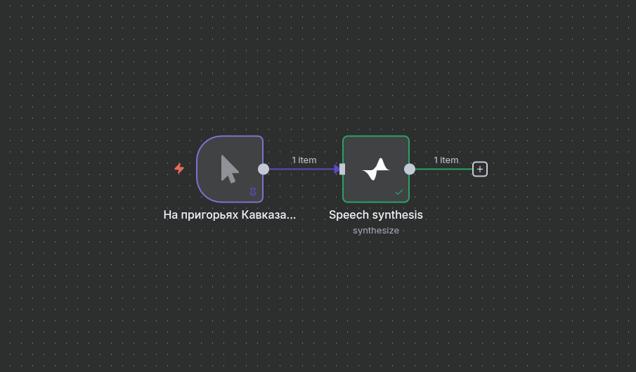
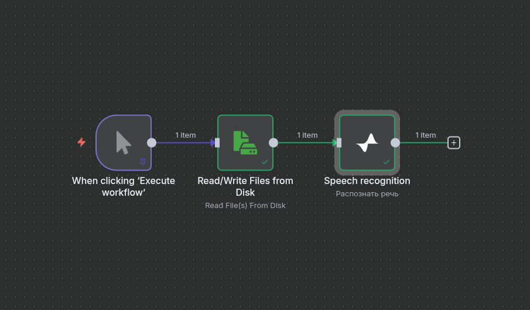

# n8n-nodes-salutespeech

***Неофициальный Community-узел. Разработано энтузиастами. Официальные интеграции смотрите на [developers.sber.ru](https://developers.sber.ru/dev).***

[n8n-nodes-gigachat](https://github.com/tomyumm-ge/n8n-gigachat) | **n8n-nodes-salutespeech** (вы здесь)

## Disclaimer

Все права на товарные знаки, логотипы [[1]](./credentials/LOGO.md) [[2]](./nodes/SaluteSpeech/LOGO.md) и иные обозначения принадлежат их законным правообладателям. Товарный знак «Сбер», логотипы и наименования сервисов Сбера являются собственностью ПАО «СберБанк». Настоящий проект не является официальным продуктом Сбера и создан независимым разработчиком в некоммерческих целях.

Это программное обеспечение предоставляется «как есть», без каких-либо явных или подразумеваемых гарантий, включая, но не ограничиваясь, гарантией товарной пригодности или пригодности для конкретной цели. Автор не несёт ответственности за любые убытки, включая упущенную выгоду, возникшие в результате использования этого ПО. Использование — на ваш страх и риск.

Проект носит экспериментальный характер и может быть неидеальным для Production.

## Описание

В этом репозитории находятся n8n-узлы для работы с **SaluteSpeech API** от Сбера:

* **Распознавание речи (Speech-to-Text)**
* **Синтез речи (Text-to-Speech)**

Эти узлы позволяют подключиться к API на высоком уровне, без необходимости вручную отправлять HTTP-запросы и обрабатывать бинарные данные.

Чтобы установить узлы, перейдите в настройки n8n, вкладка **Community Nodes**.

📌 **Ссылка на npm**: *[n8n-nodes-salutespeech](https://www.npmjs.com/package/n8n-nodes-salutespeech)*

⭐️ Если узлы оказались полезными — поставьте звезду на репозиторий. Посмотрим, сколько нас!

---

### Синтез речи (Text-to-Speech)



* **Выбор голоса и частоты дискретизации**: гибкая настройка звучания.
* **Поддержка форматов**: `wav16`, `pcm16`, `opus`, `alaw`, `g729`.
* **Прямой вывод в binary**: готовый аудиофайл можно сразу отправить или сохранить.
* **Применение**: автоматическая генерация аудиосообщений, озвучка уведомлений, голосовые ответы чат-ботов.

---

### Распознавание речи (Speech-to-Text)



* **Поддержка популярных форматов**: WAV, PCM, OGG (Opus) и др.
* **Гибкие настройки**: можно выбрать язык и модель распознавания.
* **Интеграция в процессы**: автоматическое преобразование голосовых сообщений в текст.

---

## Локальная разработка / запуск

В папке с репозиторием:

```bash
npm install
npm run build
npm link
```

В инстансе n8n:

```bash
npm i -g n8n # если ещё не установлен
# Если запускаете впервые — выполните команду "n8n"
cd ~/.n8n
mkdir custom && cd custom
npm init -y
npm link n8n-nodes-salutespeech
n8n
```

---

## Лицензия

[MIT](./LICENSE.md)
